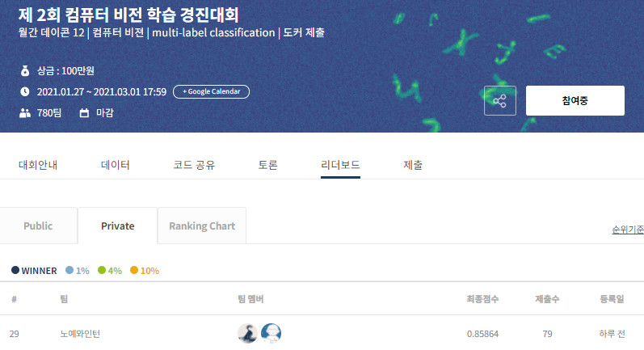

### 1. 대회 주제
- Dacon Vision Competetion - Drity Alphabet Mnist Multi-labeling Classification 
- 월간 데이콘 12 | 컴퓨터 비젼 | multi-label classification
- 링크 : https://dacon.io/competitions/official/235697/overview/

<br>

### 2. 대회 설명
- 합성한 MNIST 이미지 속에 들어있는 알파벳 찾기 / Multi-Label Classification
- (256, 256)크기의 이미지 속에 10 ~ 14개의 글자(알파벳 a – Z, 중복 제외)가 무작위로 배치되어 있으며, 이번 대회의 문제는 이러한 이미지 속에 들어있는 알파벳과 들어있지 않은 알파벳을 분류하는 multi-label classification 문제

<br>

### 3. 기간
- 2021년 02 월 1일 ~ 2021년 3월 1일
- 팀명 : 노예와인턴 (integer,  yubi6304)

<br>

<hr>

### 4. 진행 과정
- (1) 문제 파악 및 pytorch Baseline 코드 실행 (~0.83)
    - 소스파일
        - torch_baseline.py
        
- (2) ResNet18, ResNet50, DenseNet 등 Classfication 모델 학습 결과 비교 (~0.83)
    - 소스파일
        - save_per_epoch.py

- (3) EfficientNet B7 사용 학습 (~0.84)
    - Classficiation SOTA Model 사용
    - 소스파일
        - efficientnet_0221.py
        - save_per_epoch_efficientnet.py

- (4) Image 분석 및 Augmentation 선택 적용 (~0.84)
    - Affine, Rotation : 이미지 훼손 방지를 위한 15도 정도만
    - RandomVertical, horizontalflip
    - Colorjiff (contrast, brightness) : 이미지 선명도를 위한 대비 강화
    - 소스파일
        - Image_Augmentation_Fixed Rotation Degree.py
        - Image_Augmentation_Make Answer.ipynb : make augmentation answer label
        - Image_Augmentation_visualization.py : aug 옵션 visualization
        - save_per_epoch_efficientnet_augmentation.py 
        
- (5) lr_scheduler 적용 및 SAM Optimizer 등 적용 시도 (~0.85 초반)
    - 소스파일 
        - efficientnet_0224_lr_scheduler.py
    
- (6) Ensenble EfficientNet-B0, B1, B6, B7 (~0.85 중반)
    - 소스파일

<br>
<hr>

### 5. 결과
- private 29등 (상위 13%)


<br>
### 6. 디렉토리 Setting

```
dacon_dirty_mnist_competetion
├─torch_baseline.py
├─save_per_epoch.py
├─save_per_epoch_efficientnet.py
├─models  # 일반모델 저장폴더
├─data
│  ├─train
│  |  ├─05000.png
│  |  ├─05001.png
│  |  ├─ ...
│  ├─validation (검증을 위해 train 0~4999를 가져옴)
│  |  ├─00000.png
│  |  ├─00001.png
│  |  ├─ ...
│  ├─test
│  |  ├─50000.png
│  |  ├─50001.png
│  |  ├─ ...
├─dirty_mnist_answer.csv
├─dirty_mnist_answer-validation.csv (데이터에 맞춰서 원본에서 따옴)
├─sample_submission.csv

```